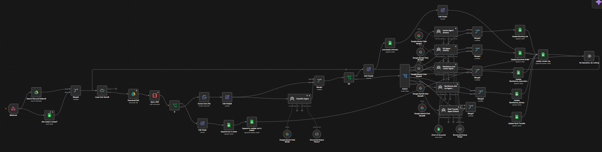
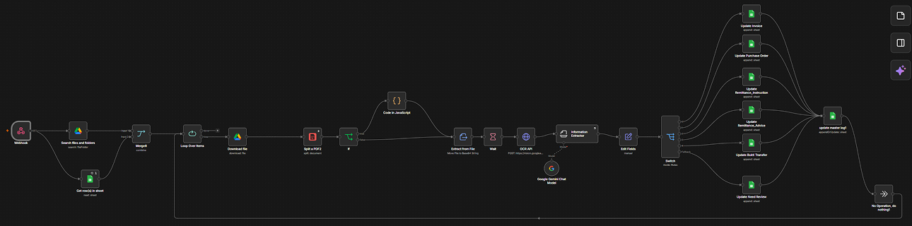

# Intelligent Financial Document Processing Workflow (n8n + Gemini AI)

An advanced, automated n8n workflow designed to fetch, classify, and extract structured data from various financial documents using Google Gemini's multimodal Vision AI.

This workflow acts as an end-to-end automated accounting assistant. It monitors incoming files, intelligently identifies document types, extracts relevant data using specialized AI architectures, and logs structured outputs directly into specific Google Sheets and a centralized Master Log[cite: 1].

---

## Evolution of Architecture: Model v1, Model v2 & Deep Extraction

To optimize processing speed, accuracy, and API billing costs, the workflow has evolved through distinct architectural iterations:

### 1. Model v1: The Multi-Agent Approach
The initial iteration used a multi-step agent pipeline[cite: 2].
* **Mechanism:** Employed one AI agent to classify the document type and a second dedicated agent to perform data extraction[cite: 2].
* **Performance:** Higher latency (~1 minute 40 seconds per file) and higher token costs (approx. Rp. 600–900 per file) due to sequential and parallel API wait times[cite: 2].

### 2. Model v2: The Unified Extractor Model
A streamlined iteration combining OCR and a unified Gemini Information Extractor pass[cite: 2].
* **Mechanism:** Eliminated the separate classification step upfront, moving logic routing (Switch nodes) to occur after extraction[cite: 2].
* **Performance:** Achieved a **60–70% speed increase** (30–40 seconds per file) and an **86% cost reduction** (Rp. 35–125 per file) with high accuracy (~95.5%)[cite: 2].

### 3. Deep Extraction Model
An specialized high-granularity extraction pipeline designed for complex documents and rosters (such as Manpower Listings and multi-page contract breakdowns)[cite: 3].
* **Mechanism:** Integrates Google Cloud Vision OCR (`DOCUMENT_TEXT_DETECTION`) with a comprehensive structural schema parser to capture deep line items, multi-page data splits, tax attributes, and granular role summaries without data loss.
* **Performance:** Enables robust handling of complex tables, overflow line items, and multi-currency breakdowns.

---

## Key Features

- **Automated Ingestion** — Triggers via Webhook or batch-processes files directly from Google Drive[cite: 1].
- **Smart PDF Handling** — Automatically downloads and splits multi-page PDFs for accurate page-by-page processing[cite: 1].
- **Unified & Specialized AI Extraction** — Routes data through optimized Gemini Vision pipelines depending on the chosen model tier.
- **Structured Output & Chart of Accounts** — Forces AI outputs into strict JSON schemas mapped to accounting ledgers[cite: 1].
- **Automated Database Logging** — Updates dedicated Google Sheets and a centralized "Master Log" for full audit trails[cite: 1].

---

## Workflow Architecture: How It Works

### 1. Ingestion & Pre-processing
The workflow searches for specific files in Google Drive, loops through each item, downloads the file, splits multi-page PDFs into digestible pages, and logs initial metadata[cite: 1].

### 2. AI Processing & Unified Extraction
Documents are processed through OCR and fed into the Gemini-powered extraction agents to capture precise key-value pairs, line items, and financial totals.

### 3. Data Synchronization & Master Logging
Extracted JSON data is cleaned, mapped, and synchronized to specific Google Sheets ledgers, concluding with an update to the unified **Master Log**[cite: 1, 2].

---

## Prerequisites & Credentials

To run this workflow in your own n8n instance, configure the following credentials:
- **Google Drive API** — For searching and downloading source documents[cite: 1].
- **Google Sheets API** — For reading tracking sheets and writing extracted data[cite: 1].
- **Google Gemini API** — Active API key for Gemini Chat/Vision models[cite: 1].
- **Google Cloud Vision API** — Required for OCR text detection in the Deep Extraction pipeline.

---

## Setup Instructions

1. Clone this repository or download the `workflow.json` or model files.
2. Open your n8n instance and click **Add Workflow**[cite: 1].
3. Select **Import from File** and upload your workflow file[cite: 1].
4. Open the workflow and configure your Google and Gemini credentials[cite: 1].
5. Update Google Drive Folder IDs and Google Sheet IDs to match your Workspace environment[cite: 1].
6. Click **Save** and toggle the workflow to **Active**[cite: 1].

---

Built with [n8n](https://n8n.io) and [Google Gemini](https://ai.google.dev)[cite: 1].
